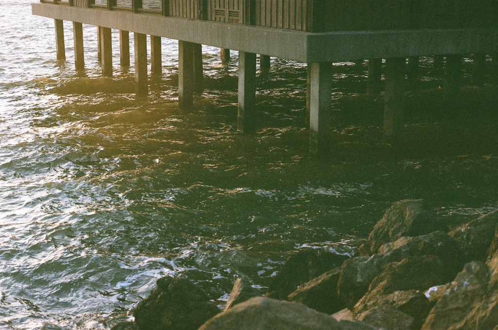

Nicole Kaack is an independent curator and writer from Northern California, currently based in Queens, New York. She works as the Dedalus Fellow in the museum archives at The Museum of Modern Art, New York, where she has assisted with archival displays for MoMA’s upcoming 2019 reinstallation as well as for Being Modern at the Fondation Louis Vuitton, Paris. Kaack will be the 2018-2019 Curatorial Fellow at The Kitchen, New York, where she will coordinate programming of the Language Art Body discussion series, as well as acting as artist liaison for the annual art auction.

Kaack’s writing has been published by Whitehot Magazine, artcritical, Art Viewer, SFAQ / NYAQ / AQ, and Artforum. Organized exhibitions include Science Fictions at CRUSHCURATORIAL, New York (2018), Re:Framed at the Re: Art Show, Brooklyn (2018), Wordless at Small Editions, Brooklyn (2017), Enveloped at Small Editions, Brooklyn (2017), and Paperless at Small Editions, Brooklyn (2017). Kaack is the co-coordinator and moderator of a series of artist conversations at CRUSHCURATORIAL, New York, co-founder of the newsletter of <i>missing out</i>, and co-director of the artist publication <i>prompt:</i>. She received her BA in art history and visual art from Columbia University in May 2016 and in Fall 2018 will begin Hunter College’s masters program in art history.

